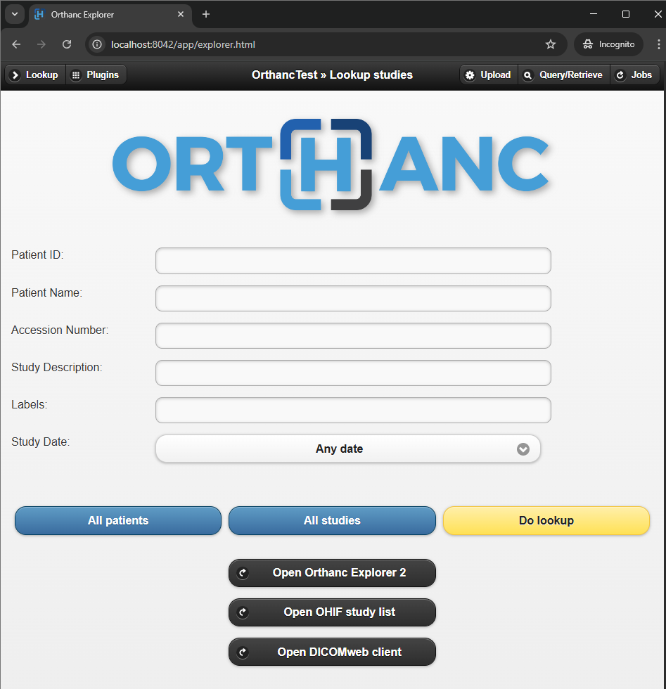

# Servidor DICOM 

_Orthanc_ es el servidor que se usará en este entorno de pruebas para poder realizar el test de recibir la información que envia los equipos médicos para lo cuál se necesita realizar los siguientes pasos en OS Windows:

1. Descargar el instalador de [Docker Dektop](https://www.docker.com/products/docker-desktop/) la versión que se esta utilizando para este entorno es: `4.40.0` y seguir las instrucciones que indican en la documentación de docker desktop
    
2. Verificar las configuraciones del archivo `docker-compose.yml`, donde se tiene dos servicios una de la base de datos en PostgreSQL y el servidor de Orthanc
   ```yaml
   # puertos que se esta usando para Orthanc que son los defectos que se manejan las cuales se pueden cambiar
    ports:
      - "xxxx:8042"   # Acceder al servidor web de Orthanc
      - "xxxx:4242"   # Puerto que recibe la información de los equipos médicos
   ```
3. La carpeta `orthanc-storage` se crea automáticamente cuando se inicia el proyecto
4. Verificar el archivo `orthanc.json`, en este archivo se tiene información necesaria para la configuración del servidor de Orthanc
    ```json
          "DicomAet": "ORTHANC",
          "DicomPort": 4242,
    ```
    Para poder conectar al servidor se necesita de tres parámetros las cuales se listan anteriormente y el `host` es la IP donde se esta ejecutándose el proyecto.
5. Configuración de usuarios para poder ingresar al servidor web de Orthanc, en esta sección se puede adaptar según lo requerido
    ```json
        "RegisteredUsers": {
            "admin": "admin123"
        }
    ```
6. Luego de revisar y hacer la configuraciones necesarias a los archivos se procede a ejecutar el proyecto abriendo una terminal donde esta el proyecto y ejecutar el siguientes comando:
    ```
        docker compose up -d
    ```
    La instrucción anterior realize la descarga de las imagenes necesarias automáticamente y ejecuta los servicios que estan definidos en el archivo `docker-compose.yml`
7. Para poder acceder al servidor Orthanc en la web accedemos al [localhost:8042](http://localhost:8042/app/explorer.html) para ver la siguiente pantalla e ingresar con las credenciales configuradas en el archivo de configuración de `orthanc.json`

---
<p align="center">

</p>

